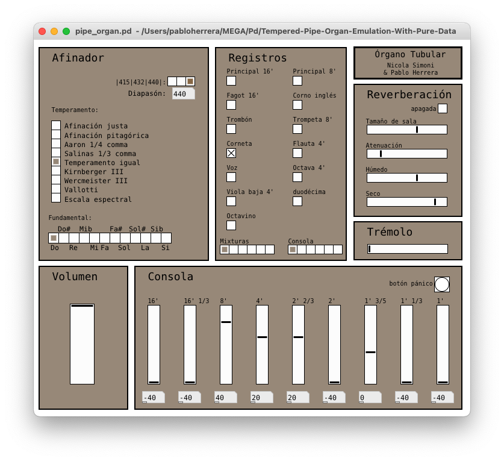

# Órgano Tubular Temperado

**Afinación y temperamentos históricoa** es un texto elaborado pro los profesores Pablo Herrera y Diego Vázquez, texto éste que aborda la temática de la historia de las afinaciones en la música atravesada por los conceptos de *lo aristoxénico* y *los pitagórico* como ordenadores de las diferentes soluciones que a lo largo de los siglos se a dado al problema de la afinación musical.

**Órgano Tubular Temperado** es un *patch* para PureData que no deja de ser una extensión del texto de Herrera y Vázquez, extensión absolutamente necesaria si realmente se desea acometer el estudio de las afinaciones, porque pretender comprender esta temática exclusivamente desde lo teórico sin incorporar la experiencia auditiva es como pretender aprender a cocinar sin comer.

## Características
* 13 registros combinables, a saber:
	* Principal 16'
	* Fagot 16'
	* Principal 8'
	* Corno inglés
	* Trombón
	* Trompeta 8'
	* Corneta
	* Voz
	* Flauta 4'
	* Octava 4'
	* Viola baja 4'
	* Duodécima
	* Octavino
* 6 memorias de mixturas de registros
* 6 memorias de consola
* Polifonía de 7 teclas
* 9 temperamento, a saber:
	* Escala espectral
	* Temperamento igual
	* Vallotti
	* Wercmeister III
	* Kirnberger III
	* Salinas mesotónico 1/3 comma
	* Aaron mesotónico 1/4 comma
	* Afinación pitegórica
	* Afinación justa
* Diapasón afinable entre 400 y 460 hz., con afinación rápida en 415, 432 y 440. 
* Efecto de *reverberación*.
* LFO.
* Control de volumen de salida.
* Controles MIDI programados para la superficie KORG NanoKontrol2.
* Botón de pánico (*panic*). El cambiar de afinación (por cualquier camino —modificando el diapasón, seleccionando un temperamento o afinando una nota en particular— mientras se está tocando una o más notas, producirá como efecto que dichas notas no se apaguen al soltar las teclas de la entrada MIDI. En esos caso, por favor, no entre en pánico y presione *panic*.